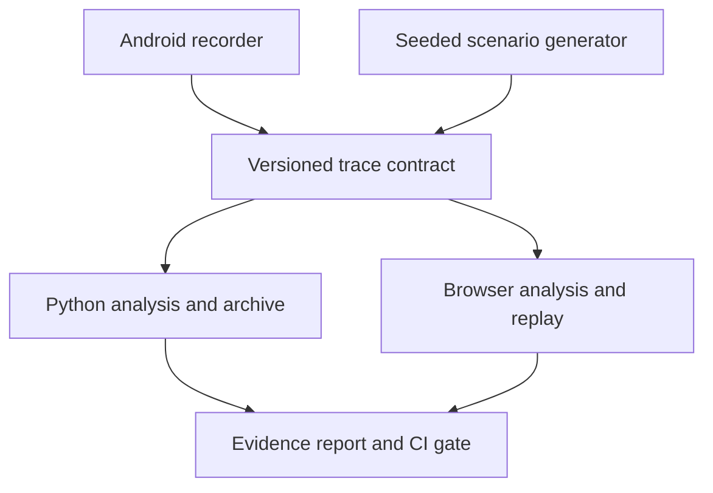

# IgnitionTrace

**Follow the evidence between vehicle signals and infotainment behavior.**

[](https://github.com/abrar0205/ignition-trace/actions/workflows/ci.yml)
[](LICENSE)

[**Open the web workbench →**](https://abrar0205.github.io/ignition-trace/) · [Run locally](docs/quickstart.md) · [Record on Android](docs/android.md) · [How the analysis works](docs/methods.md)

An open-source engineering lab for Android Automotive and infotainment software. Generate repeatable fault scenarios, import a recording, replay its state, and inspect the events behind each finding. The browser demo runs its analysis on your device. The optional Python service adds a persistent local archive and a CLI regression gate.

> The GitHub Pages workbench becomes available after the repository's **Settings → Pages → Source → GitHub Actions** is enabled and the **Deploy workbench** workflow runs. It contains synthetic scenarios; no university, employer or customer recordings are included.

## A useful first investigation

Open **The imperfect commute**, then select **Late playback after focus gain**. The timeline seeks to the focus callback at 18 seconds. Inspect its two evidence events: focus returns at 18,000 ms, but playback resumes at 20,400 ms. Compare against **A clean baseline**, which resumes in 120 ms. You have a reproducible symptom and its supporting events, ready for a debugging conversation.

## What ships

| Component | What you can do |
| --- | --- |
| Browser workbench | Generate six seeded scenarios, scrub four event lanes, change playback speed, inspect evidence, search events, compare runs, import traces and export an HTML report. |
| Analysis engine | Check frame duration, request latency, startup duration, focus-to-playback delay and stale speed samples against adjustable budgets. Every finding carries event IDs. |
| Android recorder | Capture this app's real frame metrics, audio focus callbacks, generated-tone playback calls, local HTTP probes and optional read-only VHAL speed. Export a portable JSON recording. |
| Local archive | Validate and deduplicate recordings in SQLite, reopen them in the workbench, retrieve JSON or stream events as NDJSON. |
| CLI and CI | Generate fixtures, inspect replay state and fail a regression job when a recording violates configured budgets. Shared fixtures check Python/TypeScript conformance. |

The theme is a warm, light instrument panel with cobalt controls and orange evidence markers. The route is an illustrative schematic, not recorded GPS. Fault injection changes generated trace data; it does not interfere with a vehicle or Android system services.

## Start in two minutes

With Python 3.11+:

```sh
python -m venv .venv
. .venv/bin/activate
pip install -e '.[dev]'
ignition-trace demo --scenario mixed --seed 42
ignition-trace replay runs/demo/trace.json --at-ms 20400
ignition-trace analyze runs/demo/trace.json --fail-on-findings
```

The last command intentionally exits **2**: the mixed scenario contains nine findings. `clean` exits 0. Commands write `trace.json` and `report.json` under `runs/`.

For the complete local UI + archive:

```sh
docker compose up --build
```

Open **http://localhost:8000**. See [manual installation](docs/quickstart.md) if Docker is unavailable.

## Architecture



The web and Python implementations use the same contract and detector semantics. Eighteen shared synthetic recordings cover six scenarios and three seeds. Imported recordings remain in browser memory unless you explicitly export them or save them to your local archive.

## Engineering boundaries

This is an engineering portfolio release, not a vehicle-certified product. Replay reconstructs observed state; it does not reproduce an operating system's scheduling or prove root cause. The recorder sees its own app and permitted vehicle properties, not every process in a head unit. Missing measurements stay unknown. Budgets are configurable project defaults, not OEM requirements. [Measurement definitions and limitations](docs/methods.md) explain these distinctions.

## Development

```sh
pytest -q
python scripts/export_fixtures.py
cd web
pnpm install --frozen-lockfile
pnpm test
pnpm typecheck
pnpm build:static
```

Use Node 22.13+ and the pnpm version in `web/package.json`. Android uses JDK 17, Gradle 8.9 and Android SDK 35. The [CI workflow](.github/workflows/ci.yml) builds the APK and uploads it as an artifact.

[Trace contract](docs/trace-contract.md) · [JSON Schema](docs/trace.schema.json) · [Security](SECURITY.md) · [Contributing](CONTRIBUTING.md) · [Release notes](CHANGELOG.md)

Built and maintained by [Abrar](https://github.com/abrar0205). MIT licensed; third-party notices are retained alongside vendored components.

